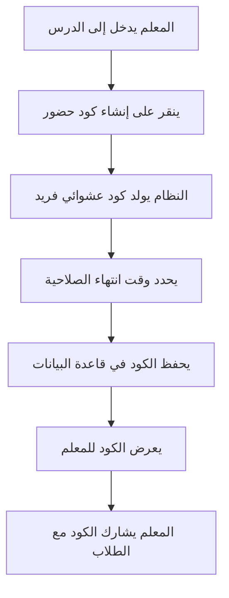
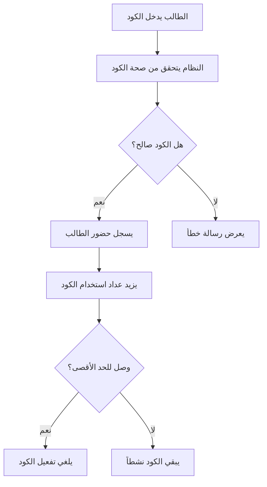

# نظام الحضور والأكواد العشوائية - شرح شامل

## نظرة عامة على النظام

نظام الحضور في هذا المشروع يعتمد على آلية الأكواد العشوائية لتسجيل حضور الطلاب. يتكون النظام من جدولين رئيسيين وموديلين مع واجهات Filament للإدارة.

---

## 📊 هيكل قاعدة البيانات

### 1. جدول `attendances` - سجلات الحضور

**الملف:** `database/migrations/2025_10_14_090010_create_attendances_table.php`

#### الحقول الأساسية:
- `id` - المعرف الفريد
- `lesson_id` - معرف الدرس (مرتبط بجدول lessons)
- `student_id` - معرف الطالب (مرتبط بجدول users)
- `status` - حالة الحضور: `present`, `absent`, `late`, `excused`
- `attendance_date` - تاريخ ووقت تسجيل الحضور
- `used_code` - الكود المستخدم في التسجيل
- `attendance_method` - طريقة التسجيل: `code`, `manual`, `auto`
- `notes` - ملاحظات إضافية
- `marked_at` - وقت التعديل اليدوي
- `marked_by` - من قام بالتعديل اليدوي

#### القيود والفهارس:
- **قيد فريد:** `unique(['lesson_id', 'student_id'])` - منع تسجيل الحضور أكثر من مرة لنفس الطالب في نفس الدرس
- **فهارس للأداء:** على lesson_id, student_id, status, attendance_date, used_code

### 2. جدول `attendance_codes` - أكواد الحضور

**الملف:** `database/migrations/2025_10_14_090058_create_attendance_codes_table.php`

#### الحقول الأساسية:
- `id` - المعرف الفريد
- `lesson_id` - معرف الدرس
- `code` - الكود العشوائي (6-10 أرقام/أحرف)
- `created_at` - وقت إنشاء الكود
- `expires_at` - وقت انتهاء صلاحية الكود
- `is_active` - حالة تفعيل الكود
- `usage_count` - عدد مرات الاستخدام
- `max_usage` - الحد الأقصى للاستخدام
- `created_by` - من أنشأ الكود (المعلم)
- `deactivated_at` - وقت إلغاء التفعيل
- `deactivated_by` - من ألغى التفعيل
- `notes` - ملاحظات إضافية

#### القيود والفهارس:
- **قيد فريد:** `unique('code')` - ضمان عدم تكرار الأكواد
- **فهارس للأداء:** على lesson_id, code, expires_at, is_active

---

## 🏗️ النماذج (Models)

### 1. نموذج `Attendance`

**الملف:** `app/Models/Attendance.php`

#### الخصائص الرئيسية:
```php
protected $fillable = [
    'lesson_id', 'student_id', 'status', 'attendance_date',
    'used_code', 'attendance_method', 'notes', 'marked_at', 'marked_by'
];

protected $casts = [
    'attendance_date' => 'datetime',
    'marked_at' => 'datetime',
];
```

#### العلاقات:
- `lesson()` - ينتمي إلى درس واحد
- `student()` - ينتمي إلى طالب واحد
- `markedBy()` - ينتمي إلى المستخدم الذي عدل الحضور

#### الدوال المساعدة:
- `getStatusLabelAttribute()` - ترجمة حالة الحضور للعربية
- `getMethodLabelAttribute()` - ترجمة طريقة التسجيل للعربية

#### النطاقات (Scopes):
- `scopePresent()` - فلترة الحاضرين
- `scopeAbsent()` - فلترة الغائبين
- `scopeByLesson()` - فلترة حسب الدرس
- `scopeByStudent()` - فلترة حسب الطالب

### 2. نموذج `AttendanceCode`

**الملف:** `app/Models/AttendanceCode.php`

#### الخصائص الرئيسية:
```php
protected $fillable = [
    'lesson_id', 'code', 'expires_at', 'is_active',
    'usage_count', 'max_usage', 'created_by',
    'deactivated_at', 'deactivated_by', 'notes'
];

protected $casts = [
    'expires_at' => 'datetime',
    'is_active' => 'boolean',
    'usage_count' => 'integer',
    'max_usage' => 'integer',
    'deactivated_at' => 'datetime',
];
```

#### العلاقات:
- `lesson()` - ينتمي إلى درس واحد
- `createdBy()` - ينتمي إلى المعلم الذي أنشأ الكود
- `deactivatedBy()` - ينتمي إلى من ألغى تفعيل الكود

#### الدوال المساعدة المهمة:
- `generateUniqueCode($length = 6)` - توليد كود فريد
- `isExpired()` - فحص انتهاء صلاحية الكود
- `isUsageLimitReached()` - فحص الوصول للحد الأقصى للاستخدام
- `canBeUsed()` - فحص إمكانية استخدام الكود
- `incrementUsage()` - زيادة عداد الاستخدام
- `deactivate($userId, $reason)` - إلغاء تفعيل الكود

#### النطاقات (Scopes):
- `scopeActive()` - الأكواد النشطة
- `scopeExpired()` - الأكواد المنتهية الصلاحية
- `scopeValid()` - الأكواد الصالحة للاستخدام
- `scopeByLesson()` - فلترة حسب الدرس

---

## 🖥️ واجهات Filament

### 1. مورد الحضور `AttendanceResource`

**المجلد:** `app/Filament/Resources/Attendances/`

#### الملفات المتضمنة:
- `AttendanceResource.php` - المورد الرئيسي
- `Pages/CreateAttendance.php` - صفحة إنشاء سجل حضور
- `Pages/EditAttendance.php` - صفحة تعديل سجل حضور
- `Pages/ListAttendances.php` - صفحة قائمة سجلات الحضور
- `Pages/ViewAttendance.php` - صفحة عرض تفاصيل سجل الحضور
- `Schemas/AttendanceForm.php` - نموذج الإدخال
- `Schemas/AttendanceInfolist.php` - قائمة المعلومات
- `Tables/AttendancesTable.php` - جدول البيانات

### 2. مورد أكواد الحضور `AttendanceCodeResource`

**المجلد:** `app/Filament/Resources/AttendanceCodes/`

#### الملفات المتضمنة:
- `AttendanceCodeResource.php` - المورد الرئيسي
- `Pages/CreateAttendanceCode.php` - صفحة إنشاء كود حضور
- `Pages/EditAttendanceCode.php` - صفحة تعديل كود حضور
- `Pages/ListAttendanceCodes.php` - صفحة قائمة أكواد الحضور
- `Pages/ViewAttendanceCode.php` - صفحة عرض تفاصيل الكود
- `Schemas/AttendanceCodeForm.php` - نموذج الإدخال
- `Schemas/AttendanceCodeInfolist.php` - قائمة المعلومات
- `Tables/AttendanceCodesTable.php` - جدول البيانات

---

## ⚙️ آلية عمل النظام

### 1. إنشاء كود الحضور



### 2. تسجيل الحضور بالكود



### 3. التحقق من صحة الكود

يتم التحقق من الشروط التالية:
1. **وجود الكود:** هل الكود موجود في قاعدة البيانات؟
2. **حالة التفعيل:** هل `is_active = true`؟
3. **انتهاء الصلاحية:** هل `expires_at > now()`؟
4. **حد الاستخدام:** هل `usage_count < max_usage`؟
5. **تسجيل مسبق:** هل الطالب سجل حضوره مسبقاً في هذا الدرس؟

### 4. حالات الحضور

- **`present`** - حاضر: الطالب حضر في الوقت المحدد
- **`late`** - متأخر: الطالب حضر بعد انتهاء وقت الكود أو تأخر
- **`absent`** - غائب: الطالب لم يحضر
- **`excused`** - معذور: الطالب غائب بعذر مقبول

### 5. طرق تسجيل الحضور

- **`code`** - كود عشوائي: الطريقة الأساسية
- **`manual`** - يدوي: المعلم يسجل الحضور يدوياً
- **`auto`** - تلقائي: للاستخدام المستقبلي (QR codes, etc.)

---

## 🔧 الميزات المتقدمة

### 1. إدارة دورة حياة الكود

- **إنشاء تلقائي:** توليد أكواد فريدة تلقائياً
- **انتهاء الصلاحية:** إلغاء تفعيل الأكواد المنتهية الصلاحية
- **حد الاستخدام:** تحديد عدد مرات الاستخدام المسموح
- **إلغاء التفعيل:** إمكانية إلغاء تفعيل الكود يدوياً

### 2. تتبع الاستخدام

- **عداد الاستخدام:** تتبع عدد مرات استخدام كل كود
- **سجل التعديلات:** تتبع من قام بتعديل سجلات الحضور
- **الطوابع الزمنية:** تسجيل أوقات جميع العمليات

### 3. الأمان والتحقق

- **أكواد فريدة:** ضمان عدم تكرار الأكواد
- **فترات صلاحية:** منع استخدام الأكواد القديمة
- **تسجيل واحد:** منع تسجيل الحضور أكثر من مرة
- **تتبع المصدر:** معرفة من أنشأ أو عدل كل سجل

---

## 📈 إحصائيات وتقارير

### البيانات المتاحة:

1. **إحصائيات الحضور:**
   - معدل الحضور لكل طالب
   - معدل الحضور لكل درس
   - معدل الحضور لكل دورة

2. **إحصائيات الأكواد:**
   - عدد الأكواد المستخدمة
   - معدل استخدام الأكواد
   - الأكواد المنتهية الصلاحية

3. **تقارير زمنية:**
   - الحضور حسب التاريخ
   - الحضور حسب الوقت
   - اتجاهات الحضور

---

## 🚀 التطويرات المستقبلية المقترحة

### 1. تحسينات الأمان
- تشفير الأكواد
- أكواد QR
- التحقق بخطوتين

### 2. ميزات إضافية
- إشعارات الحضور
- تقارير تلقائية
- تكامل مع التقويم

### 3. تحسينات الأداء
- تخزين مؤقت للأكواد
- فهرسة محسنة
- ضغط البيانات

---

## 🔍 نقاط للمناقشة والتطوير

### 1. الأمان
- هل نحتاج لتشفير الأكواد؟
- كيف نمنع تسريب الأكواد؟
- هل نحتاج لتسجيل IP addresses؟

### 2. تجربة المستخدم
- هل واجهة إدخال الكود سهلة؟
- كيف نحسن سرعة تسجيل الحضور؟
- هل نحتاج لتطبيق موبايل؟

### 3. الإدارة
- كيف نحسن إدارة الأكواد؟
- هل نحتاج لأكواد متعددة لنفس الدرس؟
- كيف نتعامل مع الحالات الاستثنائية؟

### 4. التقارير
- ما هي التقارير المطلوبة؟
- كيف نعرض الإحصائيات؟
- هل نحتاج لتصدير البيانات؟

---

## 📝 ملاحظات تقنية

### قاعدة البيانات:
- استخدام Foreign Keys لضمان سلامة البيانات
- فهارس محسنة للاستعلامات السريعة
- قيود فريدة لمنع التكرار

### الكود:
- استخدام Eloquent ORM لسهولة الإدارة
- Scopes للاستعلامات المتكررة
- Accessors للبيانات المنسقة

### الواجهات:
- Filament لواجهات إدارية احترافية
- تنظيم الملفات حسب المسؤوليات
- فصل المنطق عن العرض

---

هذا الملف يوفر نظرة شاملة على نظام الحضور. يمكننا الآن مناقشة أي جانب تريد تطويره أو تحسينه!